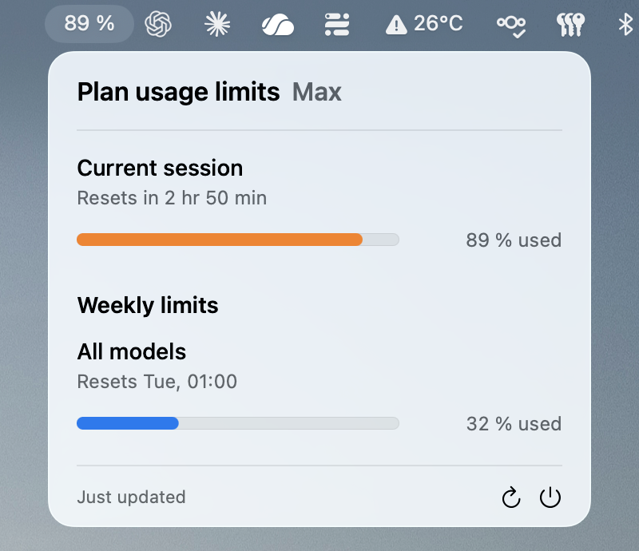

# Claude Status

A small native macOS menu-bar app that shows your personal Claude / Claude Code usage windows. Apple Silicon only, macOS 14 or newer. Bundle identifier: `io.github.phobo-at.ClaudeStatus`.



The menu bar shows the current session's utilization; the popover breaks it down by window. English and German, following your macOS language setting.

> [!IMPORTANT]
> Claude Status is an independent, unofficial project and is not affiliated with Anthropic. The internal builds are deliberately **not signed with an Apple Developer ID and not notarized**, so macOS cannot confirm the publisher and shows a Gatekeeper warning on first launch. Source code, sandbox, and data flow are separate security concerns from that.

## Security model

- Uses only your own existing Claude Code login in the local macOS Keychain.
- Reads exactly the generic-password item `Claude Code-credentials` for the current macOS user — no fuzzy matching, no legacy fallback.
- The access token is read once per app launch, kept in memory only, and never stored, logged, copied to the clipboard, or shared. Claude Code refreshes that login roughly daily, so a token rejected with a `401` costs exactly one further Keychain read and one retry; if the freshly read token is rejected too, the automatic fetch stops until you explicitly retry.
- The token is sent only as a Bearer token over HTTPS to `https://api.anthropic.com/api/oauth/usage` — technically required to fetch your usage.
- HTTP redirects are rejected; cookies, URL cache, and persistent network storage are disabled.
- The app never launches a shell or any other program. After an expired login you run `claude auth login` yourself.
- App Sandbox and Hardened Runtime are on; the sandbox holds only the outgoing-network entitlement.
- The only thing stored locally is the last usage snapshot (file `0600`, directory `0700`).
- No analytics, telemetry, ads, third-party SDKs, or external Swift packages.
- Automatic polling runs at most every fifteen minutes. Opening the popover or waking the Mac fetches only when the snapshot is at least ten minutes old. Anthropic rate-limits the usage endpoint per account, and Claude Code draws on the same budget, so the app deliberately spends it sparingly. An Anthropic `Retry-After` blocks automatic and manual requests until it expires; the popover names the time it lifts. The app's own failure backoff throttles only the automatic refresh — an explicit retry always goes through, so a network blip never locks you out of the refresh button.

Full details and limits are in [SECURITY.md](SECURITY.md) and [PRIVACY.md](PRIVACY.md).

## What "unnotarized" means

The shareable build is ad-hoc signed, so macOS can detect post-signing tampering and apply the sandbox entitlements — but the signature does **not** prove who published the app, and Apple's notary service has not scanned the binary. Recipients must establish trust themselves, ideally by at least one of: building from audited source, comparing the published SHA-256 checksum over a separate trusted channel, or obtaining the package only from the agreed internal channel or official repository. Do not distribute the app where policy allows only Developer-ID-signed or notarized applications.

## Requirements

- Apple Silicon Mac, macOS 14+
- Claude Code with an active login (`claude auth login`)
- To build: Xcode with Swift 6
- Optional: [XcodeGen](https://github.com/yonaskolb/XcodeGen) if you edit `project.yml`

## Build the shareable package

```sh
./Scripts/build-shareable.sh
```

Runs the static security checks, builds `arm64` only, ad-hoc signs, and produces:

- `dist/ClaudeStatus-Apple-Silicon-UNNOTARIZED.zip`
- `dist/ClaudeStatus-Apple-Silicon-UNNOTARIZED.zip.sha256`

`dist/` holds only what you hand to colleagues. The `UNNOTARIZED` marker in the filename is intentional — keep it. (Local dev builds go to `.build/local-output/` and are not packaged.)

## Install (for colleagues)

Put the ZIP and its checksum in the same folder and verify first:

```sh
shasum -a 256 -c ClaudeStatus-Apple-Silicon-UNNOTARIZED.zip.sha256
```

Then:

1. Unzip and drag `ClaudeStatus.app` to `/Applications`.
2. Launch it via right-click → **Open** in Finder.
3. If macOS still blocks it: **System Settings → Privacy & Security → Open Anyway**.
4. Click **Connect to Claude Code** (German: **Mit Claude Code verbinden**) in the menu-bar popover.
5. Review the Keychain dialog carefully and allow access. For an unchanged, verified build you may choose "Always Allow".

Disabling Gatekeeper globally or bulk-removing quarantine attributes is not recommended — the warning is expected macOS behavior for this distribution model. Because the shareable package is ad-hoc signed, an updated build has a new code identity, so macOS asks for Keychain access once per installed update. It does not ask again in between: the grant survives Claude Code rewriting the login item, so the app re-reads a rotated token without a dialog. For personal use, you can instead create a stable local build with a free Apple Development identity as described below.

## Develop & test locally

```sh
open ClaudeStatus.xcodeproj          # the checked-in Xcode project

./Scripts/build-local.sh             # local build (Apple Development identity, else ad-hoc) → .build/local-output/ClaudeStatus.app

./Scripts/security-check.sh          # static security rules

xcodebuild -project ClaudeStatus.xcodeproj -scheme ClaudeStatus \
  -destination 'platform=macOS,arch=arm64' \
  -derivedDataPath /tmp/ClaudeStatusDerivedData \
  CODE_SIGNING_ALLOWED=NO test       # tests
```

### Personal build with fewer Keychain prompts

A paid Apple Developer Program membership is not required for a personal build. Xcode can create an Apple Development signing identity for the Personal Team associated with a free Apple Account:

1. Open **Xcode → Settings → Accounts** and add your Apple Account if necessary.
2. Select the account, open **Manage Certificates**, then choose **+ → Apple Development**.
3. Run `./Scripts/build-local.sh`.
4. Replace your existing `/Applications/ClaudeStatus.app` with `.build/local-output/ClaudeStatus.app`.
5. Launch the app, connect to Claude Code, review the Keychain dialog, and choose **Always Allow**.

`build-local.sh` automatically uses the first valid Apple Development identity it finds. If you have several, select one explicitly:

```sh
LOCAL_SIGNING_IDENTITY="Apple Development: NAME (TEAMID)" ./Scripts/build-local.sh
```

As long as the same signing identity and bundle identifier are used, macOS can recognize subsequent personal builds by a stable code requirement, so the Keychain grant should survive rebuilds. If the script reports that it is falling back to ad-hoc signing, create or renew the Apple Development certificate in Xcode before rebuilding.

An Apple Development identity is not a Developer ID: it does not make the app notarized or suitable for distribution. Do not upload the personally signed `.app`; other users should build and sign their own local copy. The source code remains safe to commit and publish normally.

## Optional: notarized package

If a fork or later maintainer has an Apple Developer ID, the notarized path stays available:

```sh
xcrun notarytool store-credentials "ClaudeStatus-Notary"

DEVELOPER_ID_APPLICATION="Developer ID Application: ORG (TEAMID)" \
NOTARY_PROFILE="ClaudeStatus-Notary" \
./Scripts/build-notarized.sh
```

It publishes to `dist/release/` only after successful signing, notarization, stapling, and Gatekeeper checks.

## Publishing on GitHub

`dist/`, `.build/`, Xcode user data, certificates, and env files are ignored. Tests and `./Scripts/security-check.sh` should pass before every push; CI re-runs them on an arm64 macOS runner with the checkout action pinned to a fixed commit and no persisted git credentials. For releases, always publish together: the `UNNOTARIZED` ZIP, its `.sha256`, a link to this install/security info, and the matching source state or git tag. Enable "Private vulnerability reporting" on the repo, and never paste tokens, Keychain dumps, or personal data into public issues.

## License

Licensed under the [Apache License 2.0](LICENSE). Note §6: the license grants no trademark rights. "Claude" and "Anthropic" are trademarks of Anthropic — this project is independent and unofficial, and the license conveys no permission to use those marks.

## Limitations

- The app uses the `/api/oauth/usage` endpoint that Claude Code relies on. It is not a documented public Anthropic API and may change or be blocked.
- An ad-hoc-signed app has no Apple-confirmed publisher identity and no notarization.
- The access token must be sent to Anthropic over TLS for the authenticated fetch — so "the token never leaves the device" would be false.
- The design does not protect against an already-compromised Mac, user account, system proxy, or Claude Code Keychain item.
- Coordinate internal distribution with your IT/security policy.
